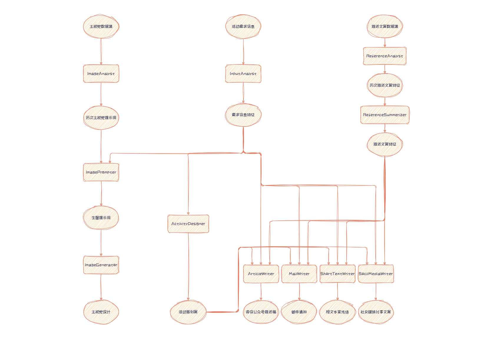

# 大信科活动规划与宣传智能系统

信息科学技术学院经常需要策划和举办各类学术讲座、科研竞赛、行业交流等活动。本系统借助Deepseek、豆包等大模型API，能够在一次性输入活动初步需求后，自动完成活动策划案、各种宣传稿以及主视觉的生成。

## 一、架构设计与Agent设计

系统总共有个Agent，可以分为输入解析、活动设计、历史文案设计、宣传文案生成、历史主视觉分析、主视觉生成六大模块。

    
    
系统整体架构与Agent分工

### 输入解析

根据用户输入，解析出若干特征：活动类型、主题方向、初步构想、活动目的、活动规模、时间安排、活动地点、可能的合作方等。

### 活动设计

根据解析出的输入特征，设计详细的活动策划案，包括活动流程和时间安排建议等。如果是竞赛类活动，还会详细设计合理的赛题、规则与评分标准。

### 历史文案分析

我们调用API对历史活动文案进行了分析和总结，但发现将结果添加入后续生成的提示词后并不能产生很好的效果。因此，我们只对历史文案进行了人工的参考。

### 宣传文案生成

宣传文案共有四个部分：微信公众号推送稿、邮件通知版本、短文本宣传语、
社交媒体分享版本。每个部分都有一个专门的Agent，根据活动策划案来生成。

### 历史主视觉分析

对历史主视觉数据集进行分析，提炼大信科主视觉的艺术特点，从而增强主视觉生成的风格一致性。由于主视觉生成是基于提示词（prompt）的，因此提炼过去主视觉的特点，可直接通过“反推提示词”来实现。所以，本模块的任务是，对数据集中每一个主视觉图片，经预处理后调用API，让大模型反推出生成该图片的可能的提示词，并储存下来备用。

### 主视觉生成

首先根据本次活动的特征以及历史主视觉分析得出的数据，使用Deepseek生成提示词，再根据提示词通过文生图模型生成主视觉。

## 二、API调用策略与参数设计

### 输入解析

### 活动策划

活动策划对逻辑性、丰富性都有较高的要求，因此我们选择使用[Deepseek-R1模型](https://api-docs.deepseek.com/zh-cn/guides/reasoning_model)。使用推理模型后，生成的质量有了明显提高，但后果是极大增大了耗时，使得该步骤成为了系统的时间瓶颈。

### 文案生成

文案生成只需要基于详细的活动策划案，选取关键信息，调整风格特点。我们选择使用[Deepseek-V3模型](https://api-docs.deepseek.com/zh-cn/)来满足需求。

为了使生成文案的风格特点更符合预期，我们为还寻找或构造了四个例子，写入提示词里，分别作为四个Agent的参考。

### 历史主视觉分析

由于需要输入图片并分析图片，我们使用了豆包的视觉理解大模型[doubao-1-5-vision-pro-32k-250115](https://www.volcengine.com/docs/82379/1494384)。调用方法为[OpenAI API](https://www.volcengine.com/docs/82379/1330626)。

豆包API在处理不同格式的图片（jpg、png）时有细微的差别，为了方便，我们先通过代码将数据集批量转化成了png格式。豆包还要求上传图片的大小不超过25M，超过这个大小的图片不多，于是我们使用Windows画图软件手动调整了大小。

在system prompt里，需强调中文输出与不输出多余信息，否则可能会生成英文提示词或带上“以下是可能的文生图提示词”的多余前缀。

### 文生图模型的选择

目前较为先进的开源文生图模型有Flux.1与StableDiffusion3.5等，但这两个模型都是基于英语训练的，极难做好对中文字符的生成。然而，主视觉的重要目的是传达核心信息，清晰明显的字体是主视觉可用性的重要保障，而英文标题的主视觉又不符合大信科的风格，因此中文字符生成的质量是模型选择的关键。总之，Flux.1与StableDiffusion3.5模型不适宜直接用作主视觉的生成。

于是，我们尝试在Flux.1的基础上添加ControlNet来实现中文字符的正确生成。首先使用Pillow库，设计文字坐标生成文字底图（textbase），然后将文字底图输入ControlNet，经过硬边缘预处理，提取出文字的轮廓，引导模型生成。

我们使用LiblibAI提供的[api接口](https://liblibai.feishu.cn/wiki/UAMVw67NcifQHukf8fpccgS5n6d#OU4KdR29zoAieyxj8EicICJ5nmg)，选择F.1-dev-fp8底模与InstantX-FLUX.1-dev-Controlnet-Union-Pro模型。最终，我们取得了一定的效果。

    

        
        
Flux.1生成的主视觉

    

    

        
        
Flux.1+ControlNet

    

然而，这种方法有几个明显的缺点：1.调用Pillow库前，需要精准计算文字底图上文字的坐标，但大模型很难生成这样精准的坐标位置；2.底图经过预处理器后仅有文字边缘，导致除文字外的部分很难生成硬边缘，只能产生诸如水彩的模糊风格。3.字体有限，难以生成艺术字；4.较小的文字仍然会变形。

因此，我们最后转向一些国内的闭源模型。经测试，字节跳动的[通用2.1-文生图](https://www.volcengine.com/docs/6791/1366783)和[即梦V2.1文生图模型](https://www.volcengine.com/docs/85621/1537648)都有一定的中文字符生成能力。（实际上不确定这两个产品是否同一个模型。另外，3.0版本已经发布，可以在网页版使用，对中文字符的生成能力更佳，但API调用接口似乎并未开放。）我们最后使用的是即梦V2.1文生图模型，通过[火山引擎SDK](https://www.volcengine.com/docs/6444/1340578)调用。

## 三、风格分析与特征提取方法论

### 输入信息特征提取

### 主视觉数据集分析

起初我们简单地把数据集中的图片交给视觉理解大模型分析，提取文字信息、背景元素、艺术风格、排版形式、配色等特征，然后再让大模型总结。然而，这样的做法严重丢失了源数据集的信息，噪声极大，最后的总结数据几乎没有参考价值。

于是，我们采用“反推提示词”的方法，将数据集图片直接转化为提示词，很好地保留了图片的信息。我们也放弃了总结的步骤，直接将若干提示词作为参考交给负责生成prompt的Agent。

## 四、性能优化与评估

可以发现，系统的一些模块具有明显的并行性。因此，我们使用python提供的多线程库，实现了大约30%的效率优化。

最后，我们统计了各Agent的耗时以及系统的总耗时。

| 测试内容    | 输入分析 | 活动策划 | 微信公众号推送稿 | 邮件通知 | 短文本宣传语 | 社交媒体文案 | 文生图提示词 | 主视觉生成 | 总时间   |
|-------------|----------|----------|------------------|----------|--------------|--------------|--------------|------------|----------|
| 运行实例1   | 9.94     | 86.92    | 21.79            | 23.32    | 5.14         | 30.87        | 35.50        | 8.34      | 128.07   |
| 运行实例2   | 19.73    | 87.80    | 36.97            | 29.02    | 13.42        | 30.29        | 63.94        | 6.50      | 150.18   |
| 运行实例3   | 20.52    | 81.71    | 27.13            | 27.95    | 13.64        | 23.85        | 56.92        | 8.30      | 136.23   |
| 运行实例4   | 16.49    | 87.00    | 22.96            | 25.09    | 7.93         | 19.37        | 62.76        | 8.07      | 128.83   |

注：总时间经过了多线程优化，且未统计Agent初始化的耗时，因此与Agent耗时之和有较大出入。

## 五、质量评估与改进方向

---

#### **一、活动策划案**  
**质量评估：**  
1. **优势：**  
   - 结构完整：涵盖赛制、日程、评分、安全、奖项等核心模块，逻辑清晰  
   - 专业性强：任务设计结合科考实践（如地质采样、生态修复方案），体现学术深度  
   - 安全保障完善：动态监控、急救预案、强制装备清单等细节到位  

2. **不足：**  
   - **信息过载**：任务包细则和评分体系文字描述密集，可读性降低  
   - **可视化缺失**：关键流程（如日程规划）未用甘特图或流程图呈现  
   - **执行细节模糊**：如“暴雨备选方案”未明确室内工作坊的具体内容  

**改进方向：**  
- **优化信息呈现**：  
  - 将“评分体系”转换为雷达图或柱状图，直观展示各维度权重  
  - 使用流程图展示强制下撤机制（如“12:00前未达半程→触发下撤流程”）  
- **补充执行细节**：  
  - 明确暴雨备选方案中的“室内生态工作坊”议程（如专家讲座、方案设计工坊）  
  - 添加凤凰线装备审核流程（如赛前技术检查清单）  
- **增强互动性**：  
  - 增设“路线选择测试”H5工具，帮助参赛者匹配适合的路线等级  

---

#### **二、文案生成（短文本/社交媒体/公众号/邮件）**  
**质量评估：**  
1. **优势：**  
   - **场景适配精准**：  
     - 短文本宣传语：口号化语言+行动号召（“金隼奖等你来夺！”）  
     - 社交媒体文案：使用emoji、话题标签（#地质科考）符合平台调性  
     - 公众号推文：故事化开头（“当城市的高楼遮蔽了星空”）引发情感共鸣  
   - **信息分层清晰**：活动亮点、规则、奖励等模块化呈现  
   - **合规性强**：安全提示、报名要求等关键信息完整  

2. **不足：**  
   - **内容重复**：多条文案中“路线分级”“任务类型”等信息重复率高  
   - **数据弱化**：社交媒体文案未突出具体奖励（如“中科院实习推荐信”）  
   - **行动引导不足**：邮件通知缺乏紧迫感（如倒计时、报名福利）  

**改进方向：**  
- **差异化内容策略**：  
  - **短文本**：强化数据亮点（如“30KM路线×中科院导师全程指导”）  
  - **社交媒体**：增加用户生成内容（UGC）引导（如“带#我的科考瞬间 晒装备抽奖”）  
  - **公众号**：嵌入往届参赛者采访视频，增强信任感  
  - **邮件**：添加进度条（如“剩余23个名额”）、福利倒计时（“前50队免装备费”）  
- **增强视觉辅助**：  
  - 邮件中插入路线3D地图预览图（需登录查看）  
  - 社交媒体文案配发任务实景GIF（如“地质采样演示”）  

---

#### **三、主视觉设计（image.png）**  
**质量评估：**  
1. **优势：**  
   - **主题明确**：核心信息（“户外徒步挑战赛”“探索·守护·同行”）突出  
   - **符号运用**：里程数字（300KM）、海拔（80m）体现专业性  
   - **品牌关联**：“山鹰杯”“金隼奖”等赛事IP露出清晰  

2. **不足：**  
   - **视觉层级混乱**：文字大小对比弱，关键信息（如“30KM”）淹没在次要数据中  
   - **色彩单调**：缺乏户外场景的活力感（如绿色系、大地色系应用不足）  
   - **情感传递弱**：缺少人物/场景插图，难以引发参与想象  

**改进方向：**  
- **重构版式设计**：  
  - 采用“F型布局”：左上角主标题→中部核心数据（30KM+任务图标）→底部CTA按钮（“立即报名”）  
  - 使用对比色突出行动号召（如亮橙色“点击报名”按钮）  
- **强化场景感知**：  
  - 背景叠加轻度透明度的山地剪影或科考工具图标（如指南针、等高线）  
  - 添加微型插画：团队协作场景（如队员共同攀岩、采集样本）  
- **动态化延伸**：  
  - 设计动态海报（GIF/视频），呈现路线地貌变化（森林→岩层→山顶）  
  - 生成AR预览：扫描海报二维码可查看3D路线沙盘  

## 六、参考资料

### API 文档

[Deepseek-V3文档](https://api-docs.deepseek.com/zh-cn/)

[Deepseek-R1文档](https://api-docs.deepseek.com/zh-cn/guides/reasoning_model)

[LiblibAI文档](https://liblibai.feishu.cn/wiki/UAMVw67NcifQHukf8fpccgS5n6d)

[豆包通用2.1-文生图文档](https://www.volcengine.com/docs/6791/1366783)

[即梦V2.1文生图模型文档](https://www.volcengine.com/docs/85621/1537648)

[火山引擎SDK文档](https://www.volcengine.com/docs/6444/1340578)

[豆包接入OpenAI API文档](https://www.volcengine.com/docs/82379/1330626)

### Prompt构造参考

[Deepseek提示库](https://api-docs.deepseek.com/zh-cn/prompt-library/)

[火山引擎Prompt最佳实践](https://www.volcengine.com/docs/82379/1221660)

### 学习资料

[Flux.1教程](https://www.fluxai.cn/detail/practical-guide-to-the-ultimate-flux1-20240915)

[ControlNet教程](https://blog.csdn.net/text2203/article/details/144979415)

[ControlNet文字嵌入](https://zhuanlan.zhihu.com/p/643811027)

### 工具

[图片转Prompt](https://imageprompt.org/zh/image-to-prompt)

[流程图绘制](https://www.drawio.com/)